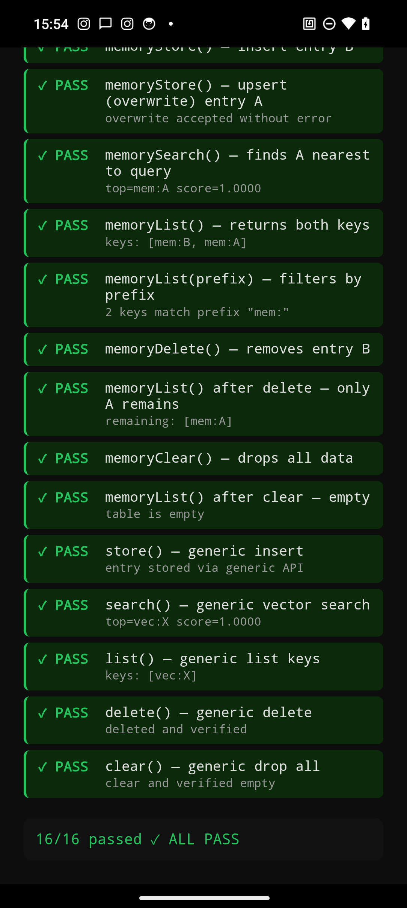
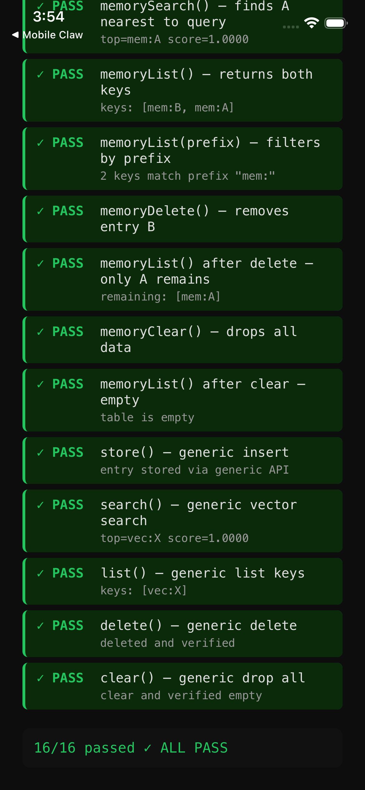

# capacitor-lancedb

[](https://www.npmjs.com/package/capacitor-lancedb)
[](https://github.com/rogelioRuiz/capacitor-lancedb/actions/workflows/ci.yml)
[](LICENSE)

Native LanceDB vector database plugin for Capacitor — on-device vector search with ANN queries, powered by Rust FFI. Includes an optional memory management layer for AI agent workflows.

## Features

- **On-device vector storage** — no cloud dependency, all data stays on the device
- **Approximate nearest neighbor (ANN) search** — fast similarity search via LanceDB
- **Generic vector DB API** — `store`, `search`, `delete`, `list`, `clear`
- **Optional memory layer** — auto-recall, auto-capture, and agent tools for AI workflows
- **Prompt injection detection** — built-in heuristics to filter unsafe stored content
- **Markdown file indexing** — chunk and index MEMORY.md and workspace files
- **Cross-platform** — Android (arm64) and iOS (arm64 + simulator)

## Install

```bash
npm install capacitor-lancedb
npx cap sync
```

## Quick Start

### Vector DB API

```typescript
import { LanceDB } from 'capacitor-lancedb'

// Open a database (auto-created if it doesn't exist)
await LanceDB.open({ dbPath: 'files://my-vectors', embeddingDim: 768 })

// Store a vector entry
await LanceDB.store({
  key: 'doc-1',
  agentId: 'default',
  text: 'The user prefers dark mode',
  embedding: [0.1, 0.2, ...], // your embedding vector
})

// Search by similarity
const { results } = await LanceDB.search({
  queryVector: [0.1, 0.2, ...],
  limit: 5,
})

// List, delete, clear
const { keys } = await LanceDB.list({ prefix: 'doc-' })
await LanceDB.delete({ key: 'doc-1' })
await LanceDB.clear()
```

### MemoryManager (optional)

The `MemoryManager` wraps the plugin with embedding generation, auto-recall, auto-capture, and agent tools:

```typescript
import { MemoryManager } from 'capacitor-lancedb'

const memory = new MemoryManager()
await memory.init({
  openaiApiKey: 'sk-...',  // for embeddings (falls back to local hash)
})

// Get agent tools to register with your AI engine
const tools = memory.getTools()

// Auto-recall: inject relevant memories before a turn
const context = await memory.recall('What theme does the user like?')

// Auto-capture: detect and store memorable content
await memory.capture('The user said they prefer dark mode.')
```

## API

### LanceDBPlugin

| Method | Description |
|--------|-------------|
| `open({ dbPath, embeddingDim })` | Open or create a database |
| `store({ key, agentId, text, embedding, metadata? })` | Store a vector entry (upsert) |
| `search({ queryVector, limit, filter? })` | ANN search, returns `SearchResult[]` |
| `delete({ key })` | Delete an entry by key |
| `list({ prefix?, limit? })` | List keys, optionally filtered |
| `clear({ collection? })` | Drop all data |

> The legacy `memoryStore`, `memorySearch`, `memoryDelete`, `memoryList`, and `memoryClear` methods are still available as deprecated aliases for backward compatibility.

### MemoryManager Tools

The `MemoryManager` exposes 5 agent tools:

| Tool | Description |
|------|-------------|
| `memory_recall` | Semantic search across stored memories |
| `memory_store` | Store a memory with duplicate detection |
| `memory_forget` | Delete memories by search or key |
| `memory_search` | Search file-indexed content only |
| `memory_get` | Read MEMORY.md snippets |

## E2E Tests

16/16 tests passing on both platforms — legacy `memory*` API (backward compat) + generic vector DB API:

<p align="center">
  
  &nbsp;&nbsp;
  
</p>

## Platforms

| Platform | Architecture | Binary |
|----------|-------------|--------|
| Android | arm64-v8a | `liblancedb_ffi.so` (41 MB) |
| iOS | arm64 (device) | `LanceDBFFI.xcframework` |
| iOS | arm64 (Apple Silicon sim) | `LanceDBFFI.xcframework` |

Prebuilt native binaries are included in the npm package. No Rust toolchain required for consumers.

## Building Native Binaries

For contributors modifying the Rust FFI code:

```bash
# Android
./scripts/build-android.sh

# iOS
./scripts/build-ios.sh
```

See [CONTRIBUTING.md](CONTRIBUTING.md) for toolchain requirements.

## Contributing

Contributions are welcome! Please read our [Contributing Guide](CONTRIBUTING.md) and [Code of Conduct](CODE_OF_CONDUCT.md).

## Security

To report vulnerabilities, see [SECURITY.md](SECURITY.md).

## License

[MIT](LICENSE) &copy; 2025-present Techxagon
